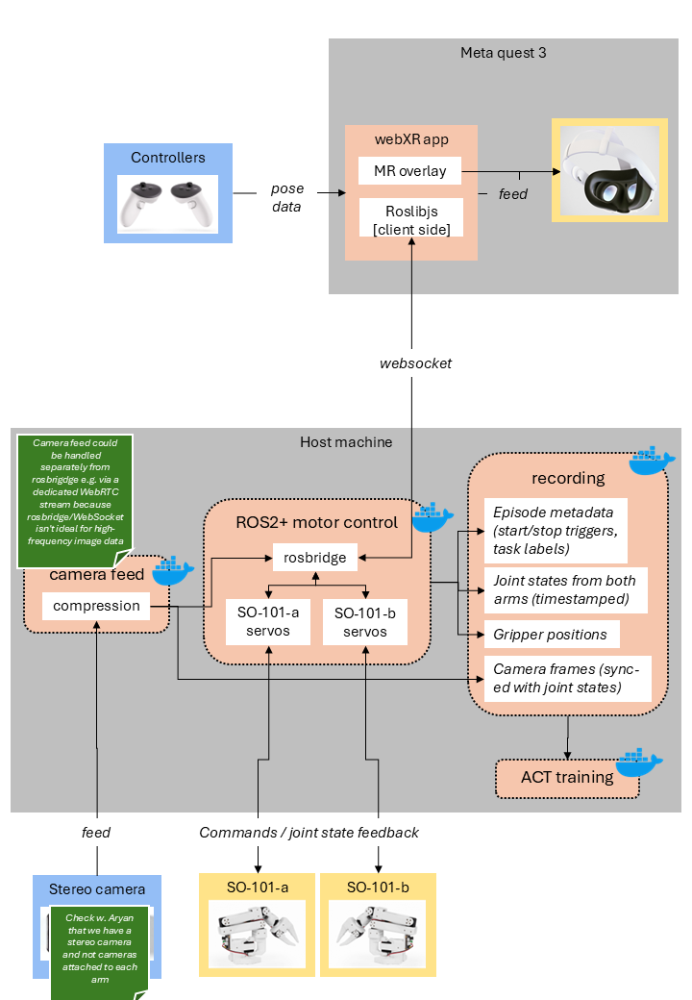

# DevOps for Cyber-Physical Systems · University of Bern · 2026

Mixed reality teleoperation system for two SO-101 robotic arms using Meta Quest 3,
integrated with the LeRobot framework for imitation learning.

## Team
| Name | Role |
|---|---|
| Dominic Kronig | undef |
| Edward Haynes | undef |
| Ramon Näf | undef |
| Yanis Berger | DevOps Lead / CI & Data Pipeline |

## Stack
- **Robot**: SO-101 (HuggingFace LeRobot), ROS2, rosbridge
- **MR Interface**: Meta Quest 3, WebXR, SimNav-XR
- **Pipeline**: Docker Compose, LeRobotDataset, ACT training
- **CI**: GitHub Actions

## Supervisors
- Prakash Aryan (prakash.aryan@unibe.ch)
- Dr. Sebastiano Panichella (sebastiano.panichella@unibe.ch)

## System architecture

